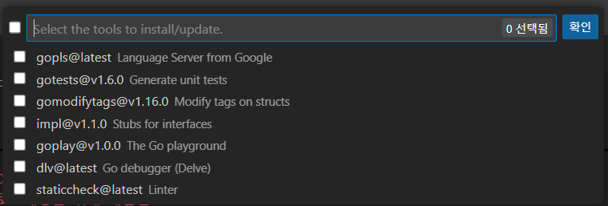
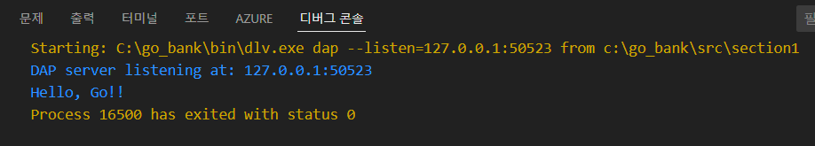

## Go언어 베이직

### TIOBE PL Ranking
- https://www.tiobe.com/tiobe-index/


### GO개발환경 설정
- 기본 
	- GoLang - https://go.dev/
	- Git - https://git-scm.com/downloads
	- Visual Studio Code - https://code.visualstudio.com/download

#### Go 설치
- https://go.dev/dl/ 에서 OS 플랫폼에 맞는 설치본 다운로드 및 섪치

	

- 설치 시 명령 프롬프트를 관리자 권한으로 실행
	- 설치 위치의 go1.XX.Y.windows-amd64.msi 설치파일 실행
	- 삭제 시 역시 명령 프롬프트에서 위의 설치파일 실행 > remove 진행
	- 설치 후 윈도우 재시작

- GO 설치 확인
	```shell
	> go version
	go version go1.22.5 windows/amd64
	> go env
	set GO111MODULE=
	set GOARCH=amd64
	set GOBIN=
	set GOCACHE=C:\Users\perso\AppData\Local\go-build
	set GOENV=C:\Users\perso\AppData\Roaming\go\env
	set GOEXE=.exe
	...
	> go doc fmt
	...
	```

##### godoc 에러 
- 아래 명령어로 실행
	```shell
	> go install golang.org/x/tools/cmd/godoc@latest
	```

- 사용자 시스템정보에 %GOPATH%\bin 추가

#### Visual Studio Code 설치
- 기본 설치 - 개발툴 경로 지정 추천 (ex, C:\DEV\IDE\Microsoft\Microsoft VS Code)
- Visual Studio Code 확장팩 설치
	- Go 설치
	- 명령 팔레트 > Go:Install/Update Tools 선택
	
	

	- 출력 탭 확인, 모두 설치 후 [info] All tools successfully installed. You are ready to Go. :) 표시되면 완료

- VS Code 실행
	```shell
	> code
	```

#### Git 설치
- 기본 설치

- Git 확인
	```shell
	> git --version
	git version 2.45.2.windows.1
	> git help push
	...
	```

#### GO 환경설정 진행
- https://github.com/golang-standards/project-layout/blob/master/README_ko.md 
- 현재는 아래의 작업을 하지않아도 진행할 수 있도록 환경이 바뀌어 있지만, 전체 구조 확인을 위해 따라하는 것도 좋은 방법

1. GO를 실행할 경로를 생성
	- 하위에 bin, pkg, src 폴더 생성
	- sysdm.cpl 시스템 속성 > 환경 변수로 진입
	- 예전에는 GOROOT 변수가 등록되었으나 현재는 Path에 GO 실행경로가 등록됨
	- 시스템 속성 > 환경 변수 > 사용자 변수에 사용자 용 go에 대한 경로가 등록되어 있음
		- 예) C:\Users\perso\go
	- GOROOT, GOPATH, GOBIN 변수명 등록

	```shell
	PS C:\> go env
	set GOMODULE=
	set GOBIN=C:\go_bank\bin
	...
	set GOPATH=C:\go_bank
	...
	set GOROOT=C:\Program Files\Go\
	``` 

	- 모든 수정이 종료된 이후 OS 재부팅

2. Mac의 경우
	- 나머지 설치는 유사
	- 설치 완료 후 위와 동일한 폴더와 pkg, bin, src 생성
	- nano ~/.bash_profile 실행
	```shell
	export GOPATH="/Users/username/Documents/go_bank
	export GOBIN=$GOPATH/bin
	
	export PATH="/Users/....:$PATH:$GOPATH:$GOBIN"
	```
	- 작성 후 source ~/.bash_profile 실행

3. 아무것도 안해도 됨!

#### 추가 플러그인
- Visual Studio Code 확장팩 설치
	- Go 설치
	- 명령 팔레트 > Go:Install/Update Tools 선택
	
	

	- 출력 탭 확인, 모두 설치 후 [info] All tools successfully installed. You are ready to Go. :) 표시되면 완료

#### 재부팅 후
- VS Code를 열고 지정한 개발소스 폴더를 오픈하면
	- bin과 pkg 폴더에 인터넷으로 부터 다운받은 패키지와 이를 컴파일한 실행파일이 생김
	- go get -u golang.org/x/tools/cmd/goimports 등...

	

#### 명령팔레트 실행
- Ctrl + Shift + P
	- Go: Initialize go.mod 클릭
	- main 입력

- 루트폴더에 go.mod 확인

#### hellogo.go 생성
- src/section1/hellogo.go 파일 생성

```go
package main

import "fmt"

func main() {
	fmt.Println("Hello, Go!!")
}
```

- Ctrl + F5 로 디버그 콘솔의 실행결과 확인

	

- 터미널에서 소스 위치로 이동

	```shell
	> go run hellogo.go
	```

#### 실행파일 생성
- 터미널에서 소스 위치로 이동

	```shell
	> go build hellogo.go
	```
	- hellogo.exe 실행파일 확인가능

- 설치명령어
	```shell
	> go install
	```
	- GOPATH의 bin 폴더에 section1.exe 파일 확인

	

[다음](./LECTURE02.md)