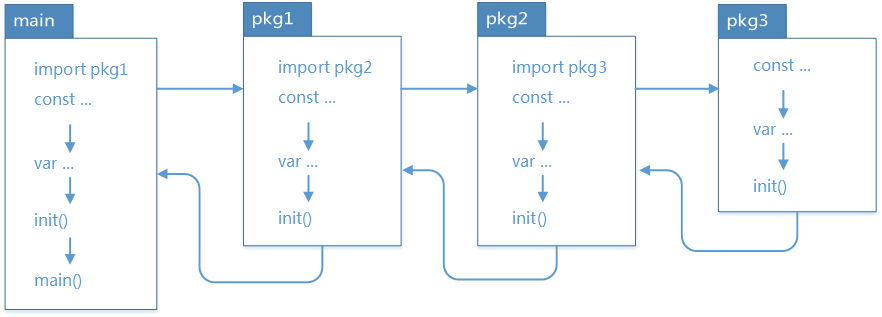

## Go언어 베이직

### Go언어 기초

#### 패키지
- 이전에 우리가 사용한 패키지, fmt, math/rand, time ...
	- C:\Program Files\Go\src 에 모두 위치
- 코드 구조화 및 재사용
- 결합도를 낮추고 응집도는 높이기 위한
- 패키지 단위 독립적이고 작은 단위로 개발 -> 모든 언어가 동일
- 패키지 이름 > 디렉토리 이름
- 같은 패키지 내 소스파일은 디렉토리 명을 패키지 명으로 사용
- 네이밍 규칙 > public 대문자, private 소문자 사용
- 사용자가 만든 패키지는 모두 GOPATH에 지정됨

##### 패키지 만들기
- 터미널에서 테스트할 것!
- part4\mylib 폴더 생성
- test.go 생성

	```go
	package mylib

	// public method
	func TestPlus(i int32) bool {
		return i > 0
	}
	```
- cust "main/src/part4/mylib" 로 변경하면 
	- cust.TestPlus(10) 로 바꿔서 사용가능

#### 초기화 메서드
- 패키지 로드시...
- 메인메서드 보다 먼저 1회 실행되는 초기화 함수
- init() 은 패키지에 넣어서 확인 해보는 것이 좋다
- init()은 여러개를 사용해도 무방하다

- 공식 레퍼런스 - https://go.dev/doc/effective_go#initialization 확인
