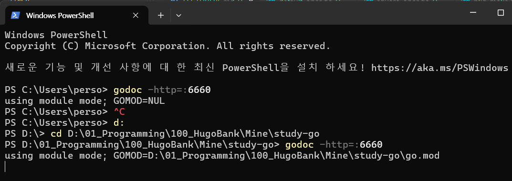
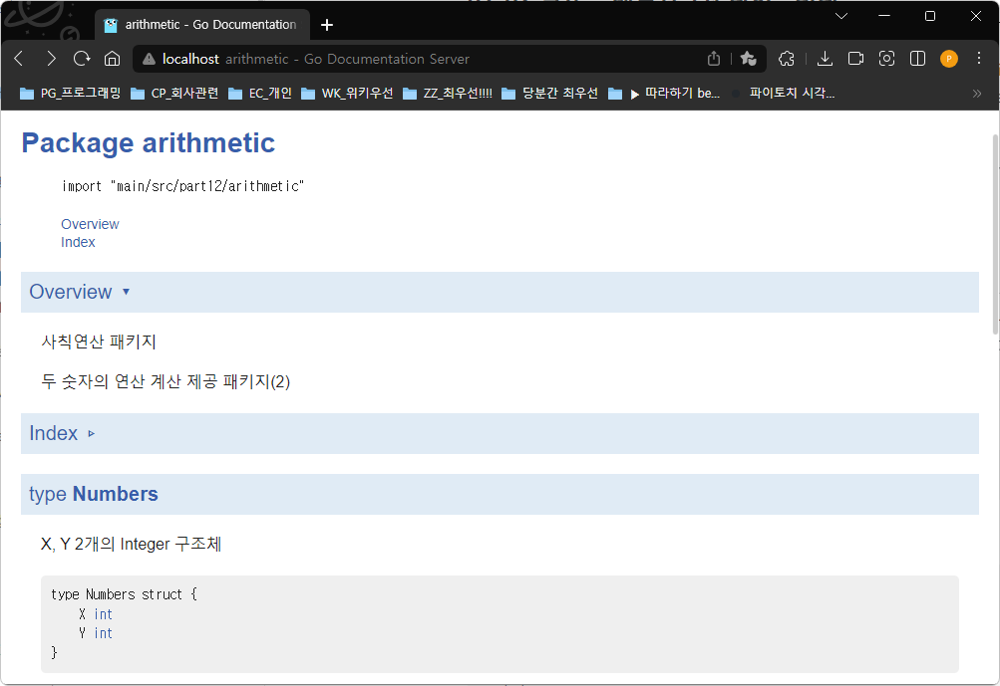
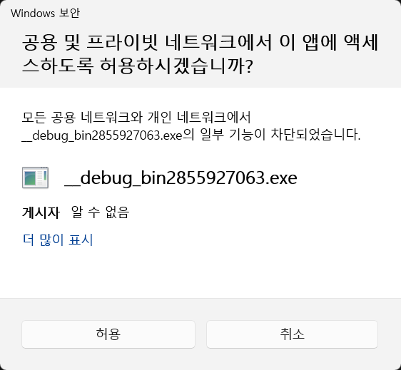
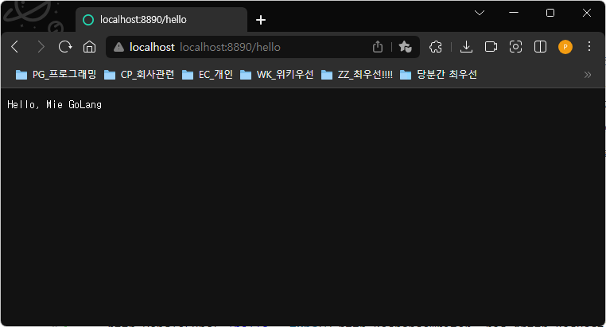
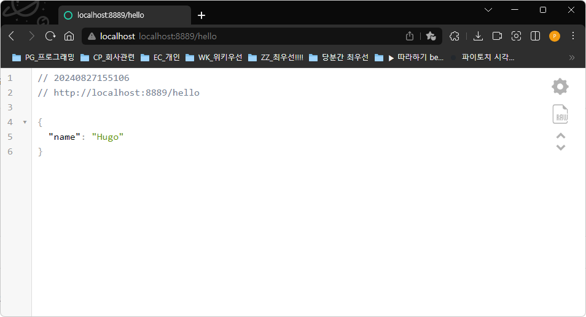
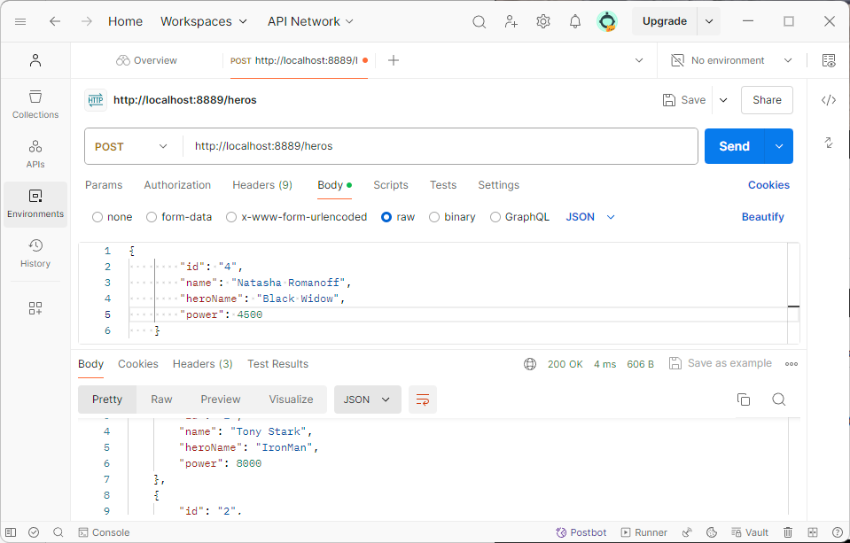

## Go언어 베이직

### Go언어 실습

#### 파일 입출력
- Create : 새 파일 작성 및 파일열기
- Close : 리소스 닫기
- Write, WriteString, WriteAt 
- Read, ReadAt
- OS별 권한 주의
- 에러처리 같이!!
- file.Stat() 파일 상태

- ioutil을 사용했지만, 1.16부터 deprecated. 사용하지 말 것

#### 내부 패키지 제작 문서화/설치
- 패키지를 잘 만들어서 제대로 전달해야 함
- 문서화 중요!!

- go install
- godoc -http=:6660






#### 외부 저장소 패키지 설치 및 사용
- 외부 패키지
	- gorilla/websocket
	- 
- GOPATH 아래 pkg에 설치

- 깃허브에서 검색후 프로토콜 외 복사 후 import 추가 
	- github.com/tealeg/xlsx

#### HTTP 처리
- HTTP GET
- HTTP POST

#### JSON / XML

#### DB연동
-  표준패키지 database/sql을 사용
- 

#### 간단 크롤링 제작
- 기본 크롤링 제작
	- MySQL: https://github.com/go-sql-driver/mysql
	- MSSQL: https://github.com/denisenkom/go-mssqldb
	- Oracle: https://github.com/rana/ora
	- Postgres: https://github.com/lib/pq
	- SQLite: https://github.com/mattn/go-sqlite3
	- DB2: https://bitbucket.org/phiggins/db2cli

- MySQL 사용
	- go get github.com/go-sql-driver/mysql
	- CRUD 

#### 웹서버
- Go의 표준 패키지인 net/http 패키지는 웹 관련 서버 (및 클라이언트) 기능을 제공
- ListenAndServe(), Handle(), HandleFunc() 등

	

	

- http.Handle() 
- 정적파일 핸들러 사용

- 웹 앱 정리
	```shell
	> tree
	├── go.mod
	├── public
	│   ├── css
	│   │   └── style.css
	│   ├── index.html
	│   └── js
	│       └── timescript.js
	└── webserver.go
	```

#### 웹 프레임워크
- https://velog.io/@yeongsummer/Golang-Golang%EC%9C%BC%EB%A1%9C-%EB%B0%B1%EC%97%94%EB%93%9C-%EA%B0%9C%EB%B0%9C%ED%95%98%EA%B8%B01.-Go-Web-Framework 
- 현재 사용/개발 중인 웹 프레임워크
	- Gin - https://gin-gonic.com/
	- Revel - https://revel.github.io
	- Gorilla - http://www.gorillatoolkit.org
	- Beego	- http://beego.me
	- Martini - https://github.com/go-martini/martini
	- GoCraft - https://github.com/gocraft/web
	- Traffic - https://github.com/pilu/traffic

- martini 라는 프레임워크에 비해 성능을 40배가까이 향상

##### Gin Web Framework
- 설치
	- go get -u github.com/gin-gonic/gin

- 작성 시 
	```go
	import "github.com/gin-gonic/gin"
	```

	

##### GET, POST, PUT, PATCH, DELETE, OPTIONS
- GET, POST, PUT, DELETE만 알아도 됨

	

#### 기타
- 추천 사이트
	- https://go.dev/doc/
	- 고를 배워야 하는 이유 - https://medium.com/@kevalpatel2106/why-should-you-learn-go-f607681fad65
	- https://www.slant.co/topics/1412/~best-web-frameworks-for-go
	- 웹 프레임워크 - https://revel.github.io/
	- 커뮤니티 - https://golangkorea.github.io/post/go-start/feature/

