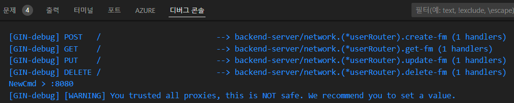
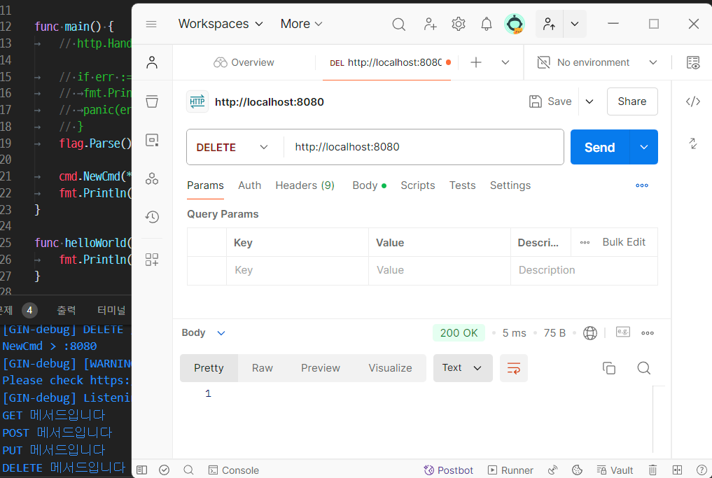
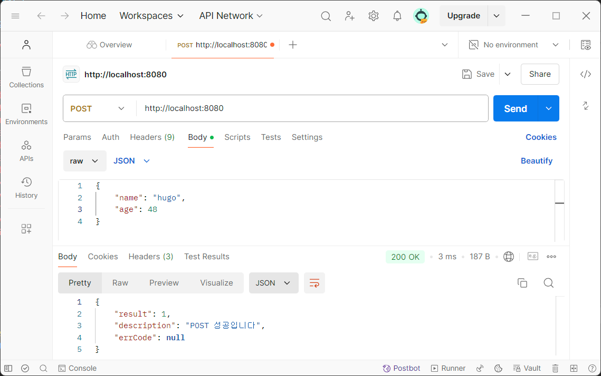

## Go언어 베이직

### Go언어 실습

#### GoLang Backend Development

##### 서버구조
- root
	- config - 서버 설정, env -> toml 사용
	- init - 서버 시작점 설정
		- cmd - 
	- network - 네트워크 api 설정 등
	- repository - 세션 정의 등 db처리
	- service - network와 repository 다리 역할
	- types - 여러 타입 선언
		- errors 

##### Go 초기화
- 명령프롬프트 > Go: Initialize go.mod 선택
	- backend-server 로 입력
- /init/cmd.go 테스트

##### config
- 패키지 설치
	- go get github.com/naoina/toml

##### gin 프레임워크
- 패키지 설치
	- go get github.com/gin-gonic/gin

##### 진행 순서1
1. /init/main.go 기본 웹서버 실행 확인
2. /config/config.go 구성설정 작성
3. /init/cmd/cmd.go 작성
4. config.toml 에 서버 설정 구성
5. /init/main.go config 관련 내용 수정
6. /network/user.go 로 유저라우터 작성

	

	

7. /network/utils.go에 /network/root.go 에 있던 함수들 이전. Response관련 함수 추가
8. /network/user.go에 u.router.okResponse 관련 추가
9. /types/utils.go Reponse 구조체와 생성 함수 작성
10. /types/user.go JSON으로 리턴하는 User구조체와 HTTP메서드 별 구조체 생성

##### 진행 순서2
1. /service/root.go에 서비스 구조체와 이를 싱글톤으로 실행하는 변수 선언. 생성자 작성
2. /repository/root.go에 저장소 구초제, 싱글톤, 생성자 작성
3. 네트워크에서는 서비스만, 서비스에서는 리포지토리만 접근 하도록 레이아웃 분리 
4. /init/cmd/cmd.go Cmd 구조체에 리포지토리, 서비스 추가. NewCmd 생성내용에 추가
5. /service/user.go 생성
6. /repository/user.go 생성
7. /service/user.go CRUD 함수 작성
8. /repository/user.go CRUD 함수 작성
9. /network/user.go CRUD 함수에서 service 메서드 사용
10. /types/user.go CreateRequest 등 구조체 추가
11. /network/user.go CRUD에 서비스 메서드 추가수정
12. /types/utils.go ApiResponse 에 ErrCode 인터페이스 추가
13. /repository/user.go의 Create 메서드 작성

	

14. PostMan에서 Get메서드 실행하면 위에서 입력한 데이터 확인가능
15. /repository/user.go UD 메서드도 추가 작성
16. /repository/user.go Delete 메서드의 에러코드 리턴에 사용하기 위해
17. /types/errors/errors.go 작성
18. /service/user.go Update메서드 수정
19. /repository/user.gp Update 메서드 변경 작성

